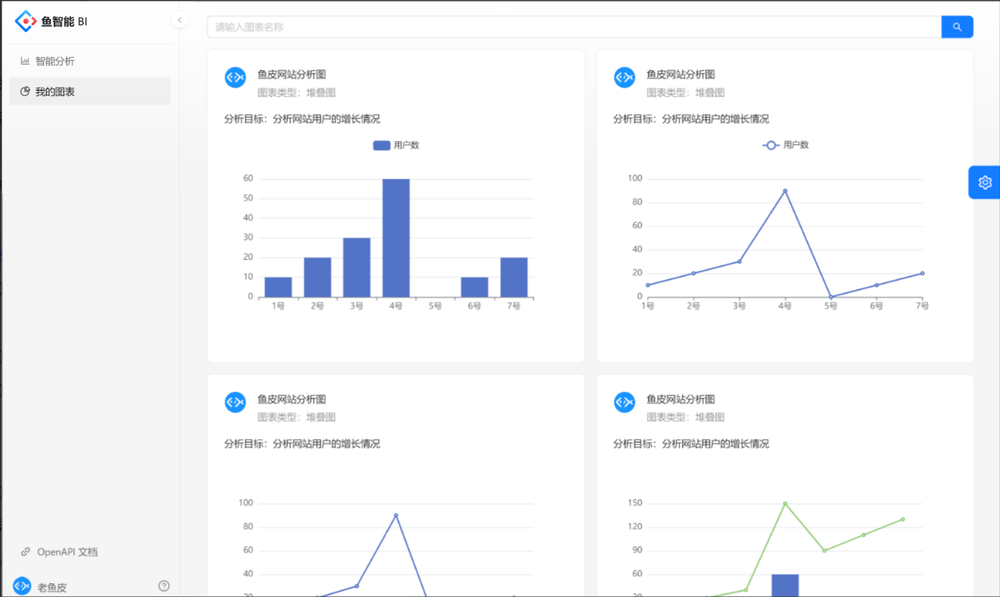
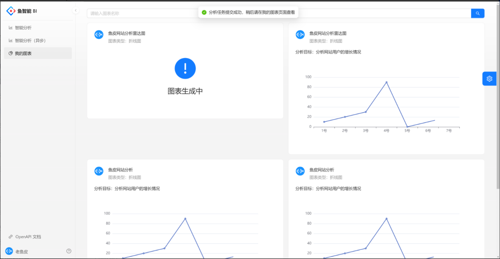

# SmartBrain智能BI平台

## 项目简介

本项目是一款基于SpringBoot、MyBatis-Plus、Redis、Redission与RabbitMq构建的高效智能数据分析平台，通过集成先进的AIGC技术，实现了用户仅需上传原始数据和输入分析需求，即可自动产生高质量的可视化图表和分析结论，极大地降低了人力与硬件资源投入于数据分析工作的成本。

## 示例图




## 技术栈
- 后端框架：Spring Boot
- ORM框架：MyBatis-Plus
- 缓存中间件：Redis
- 分布式工具：Redission
- 消息队列：RabbitMq
- 实时通讯：WebSocket

## 主要功能与关键技术

- **智能分析引擎**：借助LLM（Large Language Model）API接口，后台预设Prompt模版，结合用户提供的数据和分析诉求，封装请求并发送至LLM模型以获得固定格式的回答。解析返回结果，将其转化为Echarts图表渲染代码及对应分析结论，展示于前端界面。

- **分布式限流保护**：利用Redisson的RateLimiter实现针对单一用户发起大量分析请求的分布式限流策略，有效防止恶意占用系统资源，保证服务稳定性。

- **消息队列任务调度**：
    - **任务异步处理**：所有数据分析任务通过RabbitMQ接收和持久化，消费端采用手动确认机制，实现任务处理的异步化。
  
    - **故障转移与恢复**：对于未能成功消费的任务，系统将其转入死信队列统一处理，状态标识为“失败”，并将失败任务ID存储至Redis缓存，便于后续追踪和重试。

- **定时任务与错误重试**：利用Spring Scheduler设定定时任务，从Redis缓存和MySQL数据库中检索失败的任务。通过Redisson的分布式锁机制确保任务重新提交到消息队列的幂等性，避免重复处理。

- **实时反馈与通知**：为了提供良好的用户体验，平台集成了WebSocket技术，用于实时推送任务进度更新，无论任务完成或失败，都能即时通知用户。


---

##  核心业务逻辑代码
```java

    /*
      service实现类 使用MQ异步获取ai回复
     
      @param excelData           excel数据
     * @param genChartByAiRequest 用户请求体
     */
    @Override
    public AiResponseVO getAiResultByMq(MultipartFile excelData, GenChartByAiRequest genChartByAiRequest, HttpServletRequest request) {
        // 合法的文件后缀
        final List<String> VALID_SUFFIX = Arrays.asList("xlsx", "xls");
        // 检验文件
        String filename = excelData.getOriginalFilename();
        String fileType = FileUtil.getSuffix(filename);
        // 不是合法后缀 返回空
        ThrowUtils.throwIf(!VALID_SUFFIX.contains(fileType), ErrorCode.PARAMS_ERROR, "文件类型不符合要求");

        Long userId = userService.getLoginUser(request).getId();
        //  进行限流
        ThrowUtils.throwIf(!limiterManager.doRateLimit(LimiterKey.GEN_CHART_LIMITER + userId), ErrorCode.TOO_MANY_REQUESTS);

        // 压缩后的csv字符串
        String csvStr = ExcelUtils.excelToCsv(excelData);
        ThrowUtils.throwIf(csvStr == null, ErrorCode.PARAMS_ERROR, "上传文件失败");

        String name = genChartByAiRequest.getName();
        String goal = genChartByAiRequest.getGoal();
        String chartType = genChartByAiRequest.getChartType();
        //  异步流程    先将生成的图表保存到数据库
        Chart chart = Chart.builder().chartData(csvStr)
                .chartType(chartType)
                .userId(userId)
                .goal(goal)
                .name(name)
                .build();
        boolean saveRes = this.save(chart); //  保存后mybatis会将主键赋值给对象id属性
        ThrowUtils.throwIf(!saveRes, ErrorCode.SYSTEM_ERROR);

        // 开始真正执行任务 将任务提交给MQ 传递图表id
        Long chartId = chart.getId();
        biMessageProducer.sendMessage(chartId);
        // 返回vo对象   不包含请求结果
        return AiResponseVO.builder().chartId(chartId).build();
    }

```
---
```java
    /*
      处理图表生成任务的消费者
     
      @param chartId 图表id
     * @param channel 通道
     * @param tag     AcknowledgeMode.NONE：不确认 AcknowledgeMode.AUTO：自动确认 AcknowledgeMode.MANUAL：手动确认
                                                                  
     */
    @RabbitListener(queues = {MqConstant.BI_QUEUE_NAME}, ackMode = "MANUAL")
    @Transactional
    public void consumeChartGenTask(Long chartId, Channel channel, @Header(AmqpHeaders.DELIVERY_TAG) long tag) {
        // 获取图表id
        if (ObjectUtils.isEmpty(chartId)) {
            handleAckReject(channel, tag, false, false, "生成图表任务时 消息拒绝失败");
        }
        // 获取先前存入数据库的图表
        Chart chart = chartService.getById(chartId);
        if (ObjectUtils.isEmpty(chart)) {
            handleAckReject(channel, tag, false, false, "生成图表任务时 消息拒绝失败");
            return;
        }
        // 对图表状态修改为’执行中‘
        boolean updateRes = chartService.update(new UpdateWrapper<Chart>().eq("id", chart.getId()).set("status", ChartStatusEnum.RUNNING.getStatus()));
        if (!updateRes) {
            handleAckReject(channel, tag, false, false, "生成图表任务时 消息拒绝失败");
            return;
        }
        String goal = chart.getGoal();
        String chartData = chart.getChartData();
        String chartType = chart.getChartType();
        // 拼接用户发送给ai的请求
        String userMessage = "分析需求:\n" +
                String.format("%s,请使用%s\n", goal, chartType) +
                "原始数据:\n" +
                chartData + "\n";
        // 得到AI回复
        String response = aiManager.doChat(userMessage);
        // 进行分割
        String[] splitResponse = response.split("【【【【【");
        if (splitResponse.length != 3) {
            handleAckReject(channel, tag, false, false, "生成图表任务时 消息拒绝失败");
            return;
        }
        String chartCode = splitResponse[1].trim(); //  echarts代码
        String genConclusion = splitResponse[2].trim(); //  结论
        // 进行更新
        boolean execRes = chartService.update(new UpdateWrapper<Chart>().eq("id", chart.getId())
                .set("status", ChartStatusEnum.SUCCEED.getStatus()).set("genChart", chartCode).set("genResult", genConclusion));
        if (!execRes) {
            handleAckReject(channel, tag, false, false, "生成图表任务时 消息拒绝失败");
            return;
        }
        // 消息确认
        try {
            channel.basicAck(tag, false);
            // 向客户端发送实时消息
            //  todo    若连接已失效 消息未发送成功 则将消息存入redis及数据库
            MessageReminderServer.sendInfo("您有新的图表已完成 图表名称" + chart.getName(), chart.getUserId());
        } catch (IOException e) {
            log.error("生成图表任务时 消息确认失败");
        }
    }

```